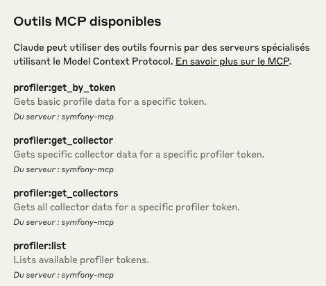
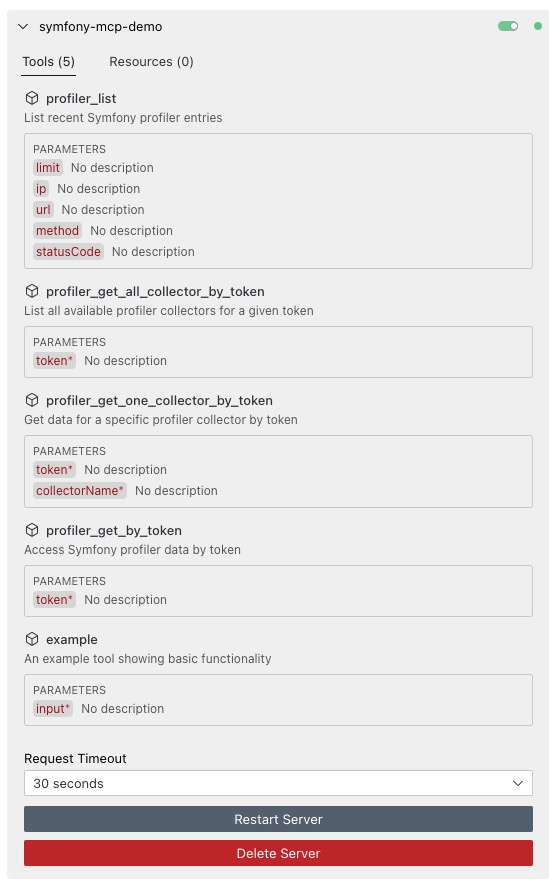
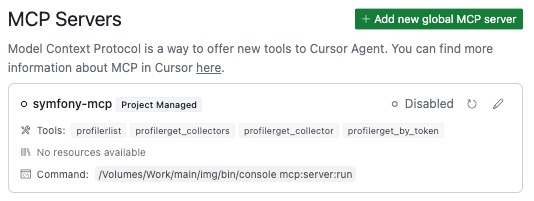

# MCP Server Bundle for Symfony

The Symfony MCP Profiler Bundle mimics the WebProfiler Bundle. It bridges the gap between Profiler data and your favorite MCP-enabled AI-powered IDE.

## Installation

```bash
composer require killerwolf/mcp-profiler-bundle:^0.1
```

## Configuration

Add the bundle to your `config/bundles.php`:

```php
return [
    // ...
    Killerwolf\MCPProfilerBundle\MCPProfilerBundle::class => ['dev' => true],
];
```

## Built-in Tools

The bundle provides several tools for interacting with the Symfony Profiler:

- **profiler_list**: Lists recent profiler entries
- **profiler_get_by_token**: Gets a specific profiler entry by token
- **profiler_get_all_collector_by_token**: Gets all collectors for a specific profiler entry
- **profiler_get_one_collector_by_token**: Gets a specific collector for a profiler entry

Here are some examples of the MCP Inspector in action with different IDEs:


*Capture d'écran de l'interface MCP Inspector intégrée avec Claude AI, montrant l'interaction avec le serveur MCP Symfony et l'accès aux données du Profiler.*


*Capture d'écran de Cline IDE avec l'inspecteur MCP, illustrant comment les outils du profiler Symfony sont exposés via le protocole MCP.*


*Capture d'écran de Cursor IDE montrant l'inspecteur MCP en action, permettant d'explorer et d'interagir avec les données du Profiler Symfony.*

## Commands

The bundle provides the following commands:

### Configure the MCP Server in your IDE (Cursor, Claude Code, Cline, etc.)

```json
{
  "mcpServers": {
    "symfony-mcp": {
      "command": "/path/to/your/symfony/project/bin/console",
      "args": [
        "mcp:server:run"
      ]
    }
  }
}
```

### Using the MCP Inspector

The MCP Inspector is a tool that allows you to interact with your MCP Server and test your tools and resources. You can use it with the following command:

```bash
npx --registry https://registry.npmjs.org @modelcontextprotocol/inspector
```

### Interacting with the Symfony Profiler (for learning/debug purposes)

The bundle also provides a command-line interface for interacting with the Symfony Profiler directly:

```bash
# List recent profiler entries
bin/console mcp:profiler list --limit=20

# Show details for a specific profile
bin/console mcp:profiler show <token>
bin/console mcp:profiler show <token> --collector=request

# Purge profiler data
bin/console mcp:profiler purge
```

## How It Works

The bundle implements the MCP protocol directly, handling JSON-RPC requests and responses according to the specification. It exposes Symfony Profiler data through a set of tools that can be called by MCP clients (like AI assistants in your IDE).

The implementation includes:

1. A command that runs the MCP server (`mcp:server:run`)
2. A service that manages the server lifecycle
3. Tool classes that implement specific functionality
4. Integration with Symfony's dependency injection system