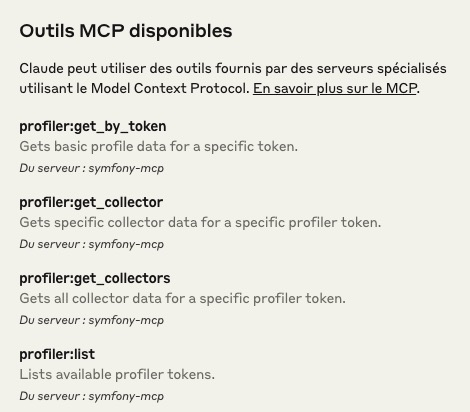
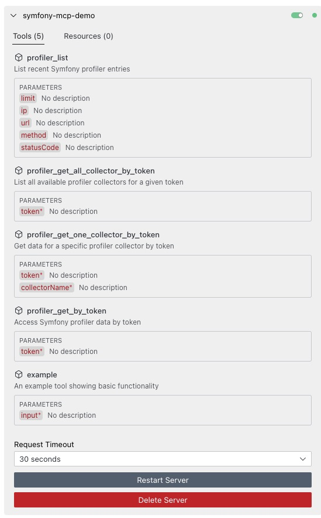
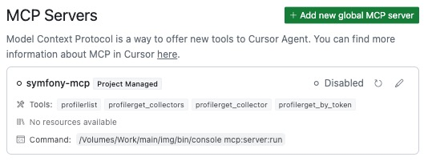

# MCP Server Bundle for Symfony

> [!WARNING]
> **This bundle is deprecated and no longer updated.**
>
> It was released in March 2025, before Symfony offered any official way to give AI coding agents access to profiler data. The official tools arrived at the end of 2025 as part of [Symfony AI](https://ai.symfony.com/). [Symfony AI Mate](https://symfony.com/doc/current/ai/components/mate.html) now does everything this bundle did, and also filters profiles by URL, status or date, redacts secrets before they reach the AI, inspects the service container and searches logs. Use it instead:
>
> ```bash
> composer require --dev symfony/ai-mate
> vendor/bin/mate init
> composer require --dev symfony/ai-symfony-mate-extension symfony/ai-monolog-mate-extension
> vendor/bin/mate discover
> ```
>
> `mate discover` also installs Agent Skills that teach your coding agent when and how to use each tool:
>
> - [`symfony/ai-symfony-mate-extension`](https://github.com/symfony/ai-symfony-mate-extension): `symfony-profiler-debugging`, `symfony-request-triage`, `symfony-service-inspection`
> - [`symfony/ai-monolog-mate-extension`](https://github.com/symfony/ai-monolog-mate-extension): `symfony-log-investigation`
> - [`symfony/ai-mate`](https://github.com/symfony/ai-mate): `php-environment-check`, `system-information`
>
> For frontend work, add the [Symfony UX skills](https://github.com/smnandre/symfony-ux-skills) (Stimulus, Turbo, Twig Components, Live Components).
>
> Version 0.2.1 is the final release. The repository stays online as a record of the project.

The Symfony MCP Profiler Bundle mimics the WebProfiler Bundle. It bridges the gap between Profiler data and your favorite MCP-enabled AI-powered IDE.

## Installation

```bash
composer require killerwolf/mcp-profiler-bundle:^0.1
```

## Configuration

Add the bundle to your `config/bundles.php`:

```php
return [
    // ...
    Killerwolf\MCPProfilerBundle\MCPProfilerBundle::class => ['dev' => true],
];
```

## Built-in Tools

The bundle provides several tools for interacting with the Symfony Profiler:

- **profiler_list**: Lists recent profiler entries
- **profiler_get_by_token**: Gets a specific profiler entry by token
- **profiler_get_all_collector_by_token**: Gets all collectors for a specific profiler entry
- **profiler_get_one_collector_by_token**: Gets a specific collector for a profiler entry

Here are some examples of the MCP Inspector in action with different IDEs:


*Capture d'écran de l'interface MCP Inspector intégrée avec Claude AI, montrant l'interaction avec le serveur MCP Symfony et l'accès aux données du Profiler.*


*Capture d'écran de Cline IDE avec l'inspecteur MCP, illustrant comment les outils du profiler Symfony sont exposés via le protocole MCP.*


*Capture d'écran de Cursor IDE montrant l'inspecteur MCP en action, permettant d'explorer et d'interagir avec les données du Profiler Symfony.*

## Commands

The bundle provides the following commands:

### Configure the MCP Server in your IDE (Cursor, Claude Code, Cline, etc.)

```json
{
  "mcpServers": {
    "symfony-mcp": {
      "command": "/path/to/your/symfony/project/bin/console",
      "args": [
        "mcp:server:run"
      ]
    }
  }
}
```

### Using the MCP Inspector

The MCP Inspector is a tool that allows you to interact with your MCP Server and test your tools and resources. You can use it with the following command:

```bash
npx --registry https://registry.npmjs.org @modelcontextprotocol/inspector
```

### Interacting with the Symfony Profiler (for learning/debug purposes)

The bundle also provides a command-line interface for interacting with the Symfony Profiler directly:

```bash
# List recent profiler entries
bin/console mcp:profiler list --limit=20

# Show details for a specific profile
bin/console mcp:profiler show <token>
bin/console mcp:profiler show <token> --collector=request
```

## How It Works

The bundle implements the MCP protocol directly, handling JSON-RPC requests and responses according to the specification. It exposes Symfony Profiler data through a set of tools that can be called by MCP clients (like AI assistants in your IDE).

The implementation includes:

1. A command that runs the MCP server (`mcp:server:run`)
2. A service that manages the server lifecycle
3. Tool classes that implement specific functionality
4. Integration with Symfony's dependency injection system